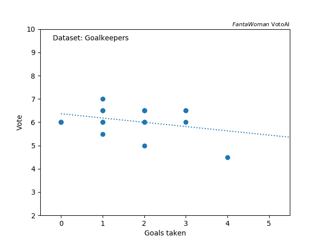

title: Data handling A

_Disclaimer: plots made with dataset available before matchweek 3_

This process consists of two steps: retrieving open source data and store them in a user-friendly format (data preparation) and pre-process the data to create the inputs for the model training (data pre-processing).

---
### Table of contents
- [Preparation](#preparation)
  - [Player positions](#player-position)
  - [Goalies](#goalies)
  - [Defenders](#defenders)
  - [Mids & Forwards](#mids--forwards)
- [Pre-processing](#pre-processing)
  - [Transforms](#transforms)
---

Preparation
-----------

Three sources of open-access data are available, however they are very limited and contain limited information on players, teams and matches. References are the following:

- [Federazione Italiana Giuoco Calcio (FIGC)](https://www.figc.it/it/femminile/club/club-serie-a/): official web-site of the Italian football association. The (cumulative) statistics of each player are available, e.g. goals, shots, yellow/red cards etc..
- [Football Statistics and History (FBref)](https://fbref.com/en/comps/208/Serie-A-Stats): database collecting statistics on football. Only limited statistics are available on women italian league, such as fixtures and average team performances (e.g. average goals and assists per match). The amount of data on women italian football league is way smaller than the corresponding men's league. For example, individual statistics including `StatsBomb` expected goals are not available for free.
- [FantaWomen](https://www.lfootball.it/fantawomen/index.php): this is the source of the target evaluation (vote, mark) for each player each match that the machine should replicate.

These data are collected every matchweek (season 2022-2023) and stored in individual files. These files are combined and transformed in the pre-processing step. A short overview on the features and their possible importance in the mark estimation is given below.

### Player position

The position (role) of the player on the pitch has a crucial role in the evaluation determination, as they depend on different features and they even span over different ranges. It is known that a good performance of a forward scoring a goal is easier to notice with respect to a defensive player, resulting in a higher average score. This would even reflect in making the mark estimation for defenders or midfielder harder and probably more accurate (and not available at the moment) features could be needed to correctly evaluate them.

_Do aggregate distributions for each position show this?_ Not really, most of the players plays mediocre, so that their evaluation (ranging from 0 to 10), see the plot below.

 
<em>  Mark (vote) distribution for different position on the pitch: goalie (G),  defender (D), midfielder (M) and forward (F). </em>

The mean and median od the distributions are almost "by definition" of mediocrity stuck at 6, but tails of the distributions are crucial. We see that goalies are easy to receive a mark of 6, that shrinks the 25% and 75% percentiles (box size), but there are some that receives way lower than that. Distributions are more spread for the other positions, despite shapes appear to be different: a significantly larger lower (higher) tail is observed for defender (attacker) positions, while midfield receive a more symmetric evaluation around 6. The changes in the player mark distributions among positions would motivate a split - even a dedicated training - for different positions. Let's look at them separately.

### Goalies

Goalies have a narrow distribution of evaluation, but still, the standard deviation is around 0.62 and higly asymmetric. Also, the available dataset is quite limited and not many information is available. For sure we can have quite a significant dependence of the mark with respect to goals taken by the team, and especially the _goal efficiency_ i.e. goals over shots on target. This is shown below.

 
<em>  Left: goalie's mark (vote) vs. goals taken. Right: goalie's mark vs. the "goal  efficiency". Colors indicate different  ranges of shots on target. </em>

The more goals are taken by the goalie, the lower the mark is expected. However, not a steady decrease of the mark is observed. We should consider the "performance" of the goalie, and not only the numbers of goals taken: this could be parametrise by the "goal efficiency" where we see that tthe less higher this number is to unity the lower the evaulations tend to be. Exceptions seem to be given by goals conceded despite the few shots on target. _Why evaluations are not low in that case?_ It depends on the quality of the shot, or corresponding "expected goaliness", that are not available, so we could be not able to catch those trends. Also goalie "activity" (other interventions, passes etc..) cannot be catched by the few information avaialble at the moment.

### Defenders

Defenders seem to be quite a spread distribution with a low tail on the mark. This seems to reflect the common saying _"you notice a defender only in case of mistakes"_. Also, we could expect their evaluation hard to parametrize: defensive plays are not registered in the available database, only fouls are recorded. Only indication on effectiveness could be given by the comparison of goals conceded with respect to the usual opponent team performance and how easy was shooting on target for the opponents, shown here below.

 
<em>  Left: defender's mark (vote) vs. how many goals the team conceded with respect to the   usual opponent goals.  Right: defender's mark vs. shots conceded. Colors indicate different efficiency  of the opponent shooting on target. </em>

Some trends are as we would expect in the defenders evaluations. The better we perform with respect to the usual opponent performance, the better the mark is. Especially, the defence seem to perform better (higher mark) in case the opponent is less competitive (low goal expectations). Some trend appears in terms of the conceded shots and _on-target efficiency_ (in different colors). Marks decrease with the on-target efficiency going up (more-or-less), that parametrizes how easy the opponents can shoot on target. Marks also scale with the total number of shots conceded, that indicates a little the offensive presence of the opponent team. The variance is still very large and correlations are weak, therefore the estimation of the mark may be hard. Different types of defensive players cannot be catched, as well as individual performance due to the limited individual defensive informations.

### Mids & Forwards

We put midfielders and forwards under the same section as the defensive midfielders are hard to mark for the same reasons as the defenders. They also show similar trends as the defenders. This holds for the offensive midfielders and forwards. An example is the similar trend observed against the total shots made by the player as shown here below.

 
<em>  Mark (vote) distribution vs. shots made. Different colors indicate  (G) midfielders and forwards.  </em>

In general, the higher mark is observed the more shots are made. The variance of the votes is large given by the different types of players as said before. Missing individual features are for sure crucial for a very accurate parametrization of the midfielder performance, such as number of (successfull) passes and their lenfth, intercepts, tackles etc.. Offensive players are featured by higher marks the more goals they score, of course. However, efficiency and offensive activity is important as shown below.

 
<em>  Mark (vote) distribution vs "goal efficiency", i.e. goals scored over shots, for fowards.   Colors indicate different ranges of shots made. </em>

The higher the goal efficiency, the higher the mark tend to be: it indicates that the player sticks out, as not many offensive chances are created by the team. The activity could be (weakly) parametrized by the number of shots made: the more active the player is the higher the mark results. For the offensive players as well, many features are missing, for example, the number of expected goal (xG), as well as offensive pass, touches in the opponent goal areas etc.. may be interesting features to correctly evaluate the forwards.

Pre-processing
--------------

This step prepares the data recorded into `json` files as inputs for the models to be trained. The pre-processing consists in several steps:
- _Connection_ : for each matchday, informations from different `json` are connected to create a dataset indexed by the players. Individual features are connected to team and match information, such as match fixtures and stats or average team performances. The target mark (vote) is also associated to each player.
- _Concatenation_ : datasets from different matchdays are concatenated.
- _Augmentation_ : dataset is augmented with features derived from the available features.
- _Transformation_ : variables are transformed in a decent format for the model training.
- _Cleaning_ : non-interesting variables are removed.

An example of the pre-processing configuration is shown in the [default settings](https://github.com/paolosabatini/fanta-voto-ai/blob/main/preprocess/settings/default.json).

### Transforms

Transformations of the original values is important to optimize the performance of the trained models. Model predictions are based on distances between different events (or players in our case), therefore a better scaling of the inputs makes the model more (or less) sensitive to corners of the datasets. Some scalers are implemented:
- _Linear_ : values are scaled linearly to have values from 0 and 1.
- _Standard_ : mean is subtracted to the values that are divided by the corresponding standard deviation. This "standardize" the distributions.
- _Association_ : values are associated to non-numeric features. Example is the association of values to positions on the pitch. For example, a step of `10` between goalies, defenders, mids and forwards. This would result in a large distance among different roles, that is hardly compensated by standardized differences of the features.