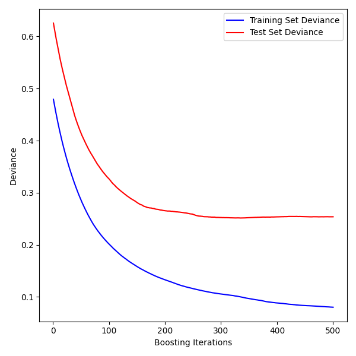

Gradient Boosted Decision Tree
-------------------------------

Since the decision tree is not optimal, one could think whether an ensemble of trees could help in the task.
The idea is to exploit the combination of so called _weak learners_ to create complex model made of simple ones. 
One of the most used boosting techniques is the gradient boosting, that is what we use in this method, implemented [here](https://github.com/paolosabatini/fanta-voto-ai/blob/main/training/models/gbdt_kf5.py) using `sklearn.GradientBooostingRegressor`.

### In a nutshell

_EDIT_: apologies for some broken notations, as markdown gives problems with some subscripts in some position, that are yet unsolved.

We described already the mechnaism of a decision tree [here](https://github.com/paolosabatini/fanta-voto-ai/blob/main/training/models/tree_kf5.py), that is used a _weak learner_ in this case.
A series of consecutive decision trees are trained in order to consecutively minimize a metric, called _loss function_ that measures the accuracy of the model in the prediction.
In our case, the loss is the `mean_squared_error` $\mathbb{L}$, defined as:

$$ \mathbb{L} = \frac{1}{N} \sum_{i}^{N}(y_i - \hat{y}_\alpha (x_i))^2 $$

where, $N$ is the number of events in the training set and $x_i$ ( $y_i$ ) stands for the features (target) of the $i$-th event. The prediction of the $\alpha$-th model of the series is represented as $\hat{y}_\alpha$.
Let's start boosting: we train the first model that is noted as $\hat{y}_0$, the first model $\hat{y}_1$ will instead be trained in order to reproduce the residuals of $\hat{y}_0$ with respect to $y$.

The residual of the $i$-th event used in the training of the first decision tree is is defined as the gradient of the loss with respect to the previos model (0-th):

$$ r_{1,i} = -  \frac{\partial \mathbb{L}}{\partial \hat{y}_0 (x_i)} = \frac{2}{N} (y_i - \hat{y}_0 (x_i))$$

Practically, the trees are sequentially trained in order to catch finer and finer structures. The model prediction on the i-th event is eventually provided by:

$$
  \hat{y}_1 (x_i) = \hat{y}_0 (x_i) + \nu \gamma_\alpha (x_i)
$$

where $gamma_{\alpha} (x_i)$ is the output of the first decision tree trained to reproduce $r_{1,i}$, and $\nu$ is called _learning rate_ that parametrize the learning speed of the gradient boosting.
Fantastic, this procedure can be repeated until corrections become negligible, meaning that we have minimized the loss!
The final prediction after K trees is given by:

$$
  \hat{y}_K =  \gamma_0 (x_i) + \nu \sum_\alpha \gamma_\alpha (x_i)
$$

where  $\gamma_\alpha (x_i)$ is the prediction of the $\alpha$-th decision tree.

-  _Pros_ : smart way to combine weak learners to provide an optimised model kind of _out-of-the-box_
-  _Cons_ : need of monitor overtraining as we train the model in order to reduce the distance from the training values.

### Training and performance

For this model, the k-folding cross-validation is also used (see [here](https://github.com/paolosabatini/fanta-voto-ai/blob/gh-pages/docs/kneigh_kf5.md) for a little more details).
Given the experience from the decision tree, the base decision tree uses a `max_depth` of 6 (mid-way from 4 and 10). The learning rate is set to $0.01$ and the number of trees is set to 500.

 
<em>  Correlation of the predicted and measured mark on test (left) and train (center) datasets. 
The left plot show the box plot of the distribution of the residuals of the prediction with respect to the target value in the testing sample.  </em>

Those are decent performance! The training set seem to be properly described, as much as a [single complex decision tree](https://github.com/paolosabatini/fanta-voto-ai/blob/main/training/models/tree_kf5.py).
However, we can see a significant degradation of the performance in the testing set, this can indeed be observed in the evolution of the loss against the iteration.

 
<em>  Loss evolution vs. iteration in the training and testing datasets.  </em>

The loss has converged, meaning that we exploited the features of our sample to the best to minimize the loss. 
However, the loss can be interpreted as the variance of the residual distribution. Therefore, the std. deviation of the residual in the testing is way larger than the training one.
How larger? The square root of the loss: the training has a precision of ~0.3, while the testing of around 0.5, as testified by the values in the box plot above.

We have the first hint here: we exploited at best the dataset, but still the model does not describe well the validation. Stats and limited info of the training dataset may be the cause.
How the model change with the tuning parameters?

### Tuning the model parameters

The change of the single decision tree `max_depth` is not fundamental, as we could just pick more complex structure with larger number of iteration.
Also, the `max_depth` is set to 6, that has observed to be nearly an optimal value. 

We could try to tune the learning rate or the number of trees to be included in the training, whose learning curves are shown here below.

 

 
<em>  Loss evolution vs. iteration in the training and testing datasets for different setups of (learning rate, number of trees).  
(top, left) (0.1, 500), (top, right) (0.1, 500), (bottom, left) (0.001, 500), (top, left) (0.01, 1000),   </em>

The learning rate really tunes how steep the learning curve of the model is. Low values of learning rate (0.001) do not make the method converge within the set limit of trees.
Increasing it to 0.1 gives more importance to each decision tree in the final prediction, and let us appreciate the expected learning curve evolution in case of overtraining.
The testing and training loss curves both decrease until the 50-th iteration.
For iterations after the 50-th, while afterwards the loss evaluated in the training set still decreases down to very small values (0.02, i.e. 0.15 of std. of the residual distribution), the loss on the test set increases.
It is the usual pattern of overfitting the training sample. The same pattern occurs in settings with increase number of trees, even though with a lower trend given the smaller learning rate.

The setting chosen to benchmark this model is indeed with learning rate of 0.01 and 500 maximum number of trees.
