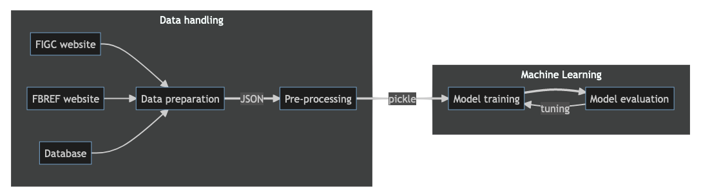

**Don't you want/can watch all matches on Sunday to give votes to players?** Just relax and let the machine do it!

This is designed to provide - _in the future_ - automatic evaluation of Serie A Women players each matchweek to be used by the [FantaWomen](https://www.lfootball.it/fantawomen/index.php). Even better, in a perfect future with _live_ statistics for players, we could give _live_ evaluations!

This web-page has just the scope of logbook (for me to keep tracks of tests/conclusions) and code/models documentations.

Documentation
-------------

Below a simple diagram of the code structure, click on the boxes to access the documentation. Blocks in red are not ready/implemented.

__EDIT:__ unfortunately `mermaid diagrams` __are not__ supported by `gh-pages` at the moment. The diagram is now converted in a static image and links are not working. Links to the documentations is provided below.

The list of models with performance are documented by clicking the model training and evaluation blocks.

### Data handling

This step consists in retrieving the information available on the web - _for free_ - and processing it as input to the machine learning algorithm.

[_Click here to discover the data!_](data_handling.md)

### Models

Several models have been tested for this analysis, starting from the easiest ones to more complex algorithms.

The goal is to reproduce the marks (votes) assigned by FantaWomen staff to players every matchweek, being half-integers from 0 to 10 (but effectively from 3 to 9). The main limitations of the predictions come poor information in dataset available: a reduced set of individual features for each players are open-access, a bit more of an insight in the available informations and desiderata are in [data handling section](data_handling.md).

On the other hand, a very limited set of values are asked to be predicted and a granularity of half-vote is required. Therefore, even the limited prediction may do the job. The goal is an accuracy over the mark spectrum less then half-vote. This is evaluated by requiring for each possible mark as the standard deviation of the residual distribution of the predicted vote with respect to the expected one. Possible biases may be calibrated out, in case they are significant.

All the models tested, with the corresponding performance studies, are documented in the link below.

- [K-neighbours regressor](kneigh_kf5.md): easiest model, and not machine learning at all. Just a sort-of look-up table from the available dataset in input.
- [Decision tree regressor](tree_kf5.md): sligthly more complicated model, made of sequential hierarchical decision to categorize the input events and extract the most typical value for the category.
- [Gradient boosted decision tree regressor](gbdt_kf5.md): a gradient-boosted sequence of decision trees to learn increasingly finer structure of the data.
- [Neural Network](tfnn.md): a neural network model, to challenge the performance of the gradient boosted decision tree.

### Ideas

A collection of ideas that may help in the future, in case the available information improve or in general to enhance the performances.

- [ ] __Clustering__ : we could try to identify various typologies of players by clustering algorithms. This could be used to produce subsets for the trainings. This technique could help a lot in both cases individual player features available are enhanced or not.
  - _Poor_: still this could be used to differentiate offensive / defensive players, since defensive (offensive) player will systematically gets higher vote in defensive (offensive) played matches with good result.
  - _Enhanced_: it may even help in the classification of sub-positions, such as: central defender, lateral defender, playmaker, stopper, mid-wing, wing, central forward, second forward, number 10. It could be done manually, but this would be automathic and catch change in players attitude over time.