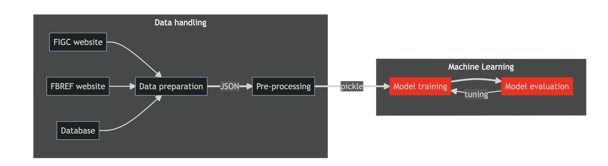

**Don't you want/can watch all matches on Sunday to give votes to players?** Just relax and let the machine do it!

This is designed to provide - _in the future_ - automatic evaluation of Serie A Women players each matchweek to be used by the [FantaWomen](https://www.lfootball.it/fantawomen/index.php). Even better, in a perfect future with _live_ statistics for players, we could give _live_ evaluations!

This web-page has just the scope of logbook (for me to keep tracks of tests/conclusions) and code/models documentations.

Documentation
-------------

Below a simple diagram of the code structure, click on the boxes to access the documentation. Blocks in red are not ready/implemented.

__EDIT:__ unfortunately `mermaid diagrams` __are not__ supported by `gh-pages` at the moment. The diagram is now converted in a static image and links are not working. Links to the documentations is provided below.

The list of models with performance are documented by clicking the model training and evaluation blocks.
