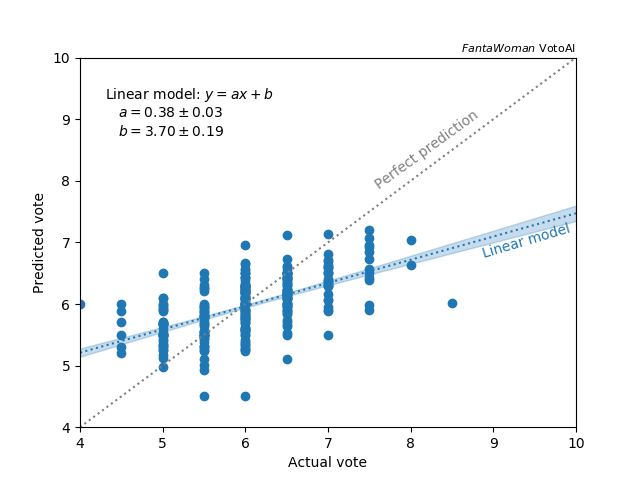
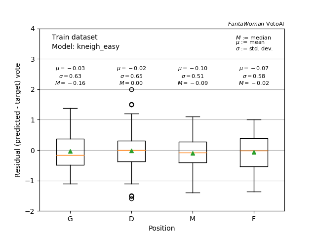
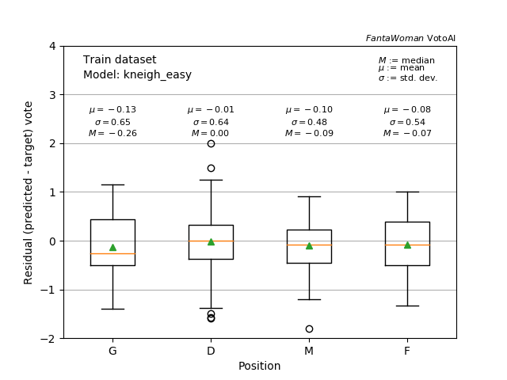
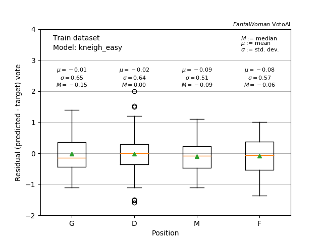

K-neighbours regressor
----------------------

This is literally the easiest algorithm you can put together for a regression, and for this reason it has many limitations. However, this could be a quick-and-dirty benchmark. The definition of the model is [here](https://github.com/paolosabatini/fanta-voto-ai/blob/main/training/models/kneigh_easy.py).

### In a nutshell

It is a very easy way to have a regression and indeed no machine learning is in place: no correlation are learned, no nodes are created, no neurons are defined. It is just a very large look-up table, based on the dataset in input.

Given the `N` features in input for the training, the `N`-dimensional space is populated with the dataset points. For each new _event_ (or player in our case), the regressed value of the target is given by the mean of the `K` closest neighbours. There are two parameters to be tuned: `K`, clearly, and the type of mean that could be weighted by the distance of the points or not. Also the type of "searching algorithm" could be set.

-  _Pros_ : easy and intuitive.
-  _Cons_ : highly dependent on the input dataset - it overtrains by definition in case of poor stats. Never able to reproduce extreme values or "out-of-range" values. Higly dependent on pre-processed data as distances among points dominate the computation. In case of many points with a single target values, it will tend to give close values to that.

### Training and performance

Since we have already a limited statistics of the training sample, we _must_ optimize the training/testing splitting. We used _k-folding_ cross-validation. It consists of splitting the dataset in `k` subsets and `k` models are trained. Each model is trained on `k-1` sub-dataset and tested in the remaining one. This let us to evaluate the model over the whole dataset.

The following figures show the performances of the model as correlation plot of the target and predicted marks and the residuals distributions.

 
<em>  Left: correlation plot of the target mark vs. the predicted mark. Right: residual   distribution for each role, goalkeeper (G), defender (D), mids (M) and forwards (F) </em>

Too bad, variance is very large, meaning that the distances do not really catch the correlations, but tend to give score quite centered around the most probable value. Also the variance is not dependent on the position on the pitch, meaning that the prediction seem to catch the overall trends of each player role, but still the variance is quite large.

### Additional studies & tuning

To separate further the estimation for each role, we could increase the step for the position encoding in the training. However, not a bit change is observed, and counter-intuitively improves with smaller steps. This is probably due to the limited number of points and a bit better averaging by using "closer" positions.

 
<em>  Distribution for each role, goalkeeper (G), defender (D), mids (M) and forwards (F) for a   step for position association of 1 (left), 10 (center, default) and 100 (right)</em>

