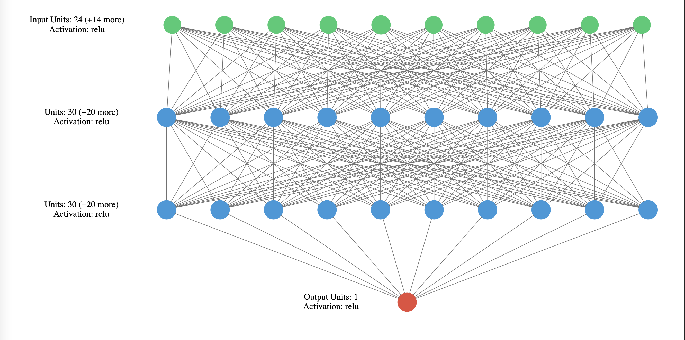
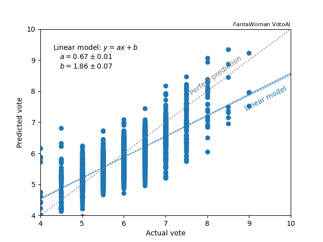
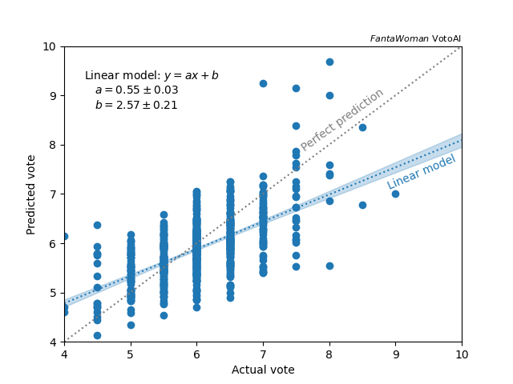
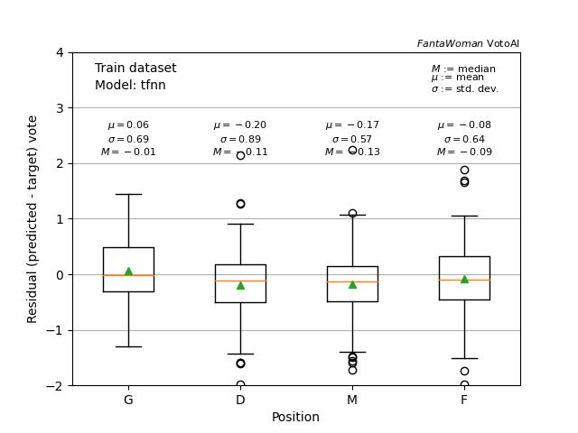
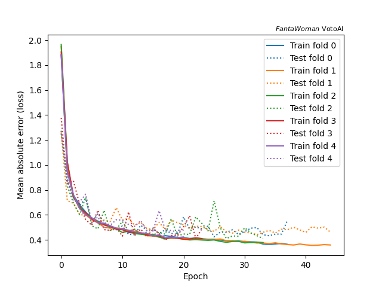
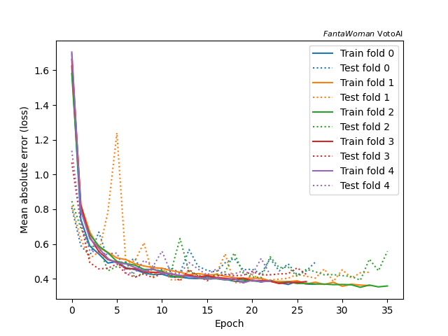
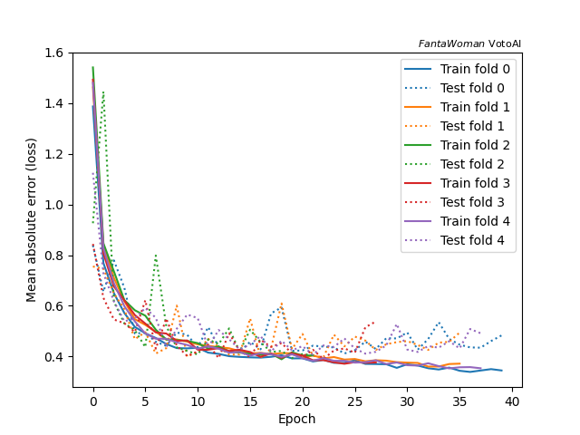

Neural Network
--------------

The gradient boosted decision tree seems to provide the best prediction so far, exploiting at best the information of the dataset.
However, there might be other structures that might be less prone to overfitting, and therefore may produce better results.
Here the Neural Network comes: instead of splitting the data to in smaller and smaller datasets with common features, the neural network may use different nodes of the structures (neurons) to learn specific patterns of the input dataset.
The model is [here](https://github.com/paolosabatini/fanta-voto-ai/blob/main/training/models/tfnn.py) using the `tensorflow` implementation within the `keras` library.

### In a nutshell

As the name suggests, neural networks are inspired by human brain, where information is processed by a large amount of interconnected neurons (nodes), resulting in an output.
The structure of the benchmark model that is used in our implementation is shown below. 

 
<em> Scheme of one of the trained models, two layers of twenty nodes.</em>

The input features $\vec{x^i}$ of the $i$-th event are given in input to each node of the first layer as a linear combination of them. F
or example, the input value to the first node of the first layer $\chi^i_{1,1}$  for the $i$-th event would be.

$$
  \chi^i_{1,1} = b_1 + \vec{w_1} \vec{x^i}
$$

where $b_1$ and $w_1$ are the bias and weights of the first node of the first layer. The node gives an output that is the result of the _activation function_ of the input value.
The output of the nodes of the first layers will be the input of the following layers, and so on until the last output node is reached.

We see already the complexity of the model, with respect to the easy decision tree structure, that leads to a more complex set of model parameters. 
Each node is featured by weights and bias that are adjusted during the training procedure (coming in the next paragraph). However, the initial values must be set, and this is let to the user.
In this case, the weights are normalised as a standard gaussian values with null mean. It makes sense, given that most of the parameters have the same order of magnitude and usually with values within 1.
The activation function plays also a crucial role. In this case, the [_rectified linear unit_](https://en.wikipedia.org/wiki/Rectifier_(neural_networks)) (ReLU) is used. 
It has shown to be quick to compute (good for training) and to outperform other non-linear activation functions in most of the posed problems, from simple regression up to computer vision even.

Let's now dig a bit into the training procedure. As the gradient boosting, the neural network is trained with several iterations (epochs) over the input training sample aimed at the minimization of a metric that measures the accuracy of the prediction.
Similarly to the gradient boosted decistion tree (GBDT), this neural network uses a loss function that is the `mean_absolute_error`, i.e. the square root of the `mean_squared_error`. The bias and weights of each node in the architecture are updated over sub-sets of the initial sample, called batches.
This let to reduce the memory consumption and computation time, but still with a convergence to the optimal point.

To understand the training procedure, let's assume a neural network with $M$ layers, each of them with $M_i$ ($i$ within $[1,L]$) nodes, all using the same activation function $A$, terminating with a single output node.
As in the GBDT case, everything starts from the loss, since it must be minimized at the end of the training. 
The prediction of the model $\hat{y}_i$ consists of the output of the activation function of the output node ($o$), based on the ouputs of the $L$-th layer nodes $\vec{\chi}_L$.

$$
  \hat{y} = A ( b_o + \vec{w_o} \vec{\chi}_L) := A_o
$$

where $b_o$ and \vec{w_o} are bias and weights of the output node. Therefore, the loss computed over $N_b$ events in the batch is:

$$
\mathbb{L}_{b} = \sum_{i = 1}^{N_b} | y_i - \hat{y}_i | = \sum_{i = 1}^{N_b} | y_i - A_o |
$$

Therefore, it can be minimized as a function of the biases and weights of the output node:

$$
  \frac{ \partial \mathbb{L}_{b} }{ \partial b_o} = \cdot \sum_{i = 1}^{N_b} \frac{y_i - A_o }{| y_i - A_o |} \cdot  \frac{\partial A_o}{\partial b_o} \\
$$

$$
 \frac{ \partial \mathbb{L}_{b} }{ \partial w_{o,j}} = 2 \cdot \sum_{i = 1}^{N_b} \chi_{L,j} \cdot  \frac{y_i - A_o }{| y_i - A_o |}   \cdot \frac{\partial A_o}{\partial w_{o,j}}
$$

All the quantities that appear in these are either known or can be computed (e.g. the derivative of the activation function, that is trivial in case of ReLu).
The parameters of the output node can therefore be updated such as:

$$
  b'_o = b_o + \nu\cdot \frac{ \partial \mathbb{L}_{b} }{ \partial b_o } 
$$

$$
  \vec{w'}_o = \vec{w_o} + \nu\cdot \frac{ \partial \mathbb{L}_{b} }{ \partial w_{o,j} } 
$$

where $\nu$ is the famous _learning rate_. Based on this, the expected input of the node can also be updated as $\chi'_L = b'_o + \vec{w'}_o \vec{\chi}_L$.
The updated $\chi'_L$ represent the target value for the $L$-th layer, specifically for each node of the layer, so that we can define a new loss for each node $j$:

$$
  \mathbb {L}_{b,L,j} =  \sum_{i = 1}^{N_b} | \chi'_{L,j} - \chi_{L,j} |
$$

So that we can recursively update backwards all the parameters of all the layers: the so-called _back-propagation_.

The process is quite time and resource consuming, indeed neural networks had to wait for more powerful computing and memory resources to be efficiently implemented.
Currently, the technology is not anynmore a problem, however techniques to improve the performances of the training are implemented, called `optimizer`. 
In this exercise, we use the `RMSprop` optimizer, that has the feature of a including the learning rate as node parameter to be dynamically changed during training depending on how important the node is in the final output.
Also other optimizer implement this feature (e.g. `Adam`), but with a different scheduling strategy of the learning rate.

### Training and performance

For this model, the k-folding cross-validation is used (see [here](https://github.com/paolosabatini/fanta-voto-ai/blob/gh-pages/docs/kneigh_kf5.md) for a little more details). The model that has been initally used is the same depicted in the schematic figure above consisting of 2 layers of 30 nodes.

The performances in terms of accuracy in the training and testing sets is shown below.

   
<em>  Correlation of the predicted and measured mark on test (left) and train (right) datasets.  
The left plot show the box plot of the distribution of the residuals of the prediction with respect to the target value in the testing sample. 
  _EDIT_ label in the plot on the right is wrong. </em>

It is interesting to see how close this time the testing and training sample performances are, this show the resilience of this technique to overtrain (even in case techniques such as _dropout_ are not used). However, the performances seem not to be as good as the GBDT. Looking at the convergence plot.

 
<em>  Loss evolution vs. iteration in the training and testing datasets.  </em>

The loss on the testing dataset is higher than in the training as expected (contrary to the initial part, due to the delay of evaluation of training and testing sets). However, the difference is lower than in the GBDT, by half, meaning that the neural network is more resistent to overtraining (or the model is too simple). The fluctuations on the performance, especially in the training set, indicates a the impact of statistical fluctuation onto the model, that seem pretty large. This is probably due to the large number of parameter to be assessed in the training, that need for more statistics to have a robust behaviour.

Can we do a more complext system to improve the performances? We still see large biases and not great closure.

### Tuning the parameters

Two more complex neural nets have been trained, increasing the number of layers, and consequently the number of nodes per layer. The corresponding loss curves are shown below.

 
<em>  Loss evolution vs. iteration in the training and testing datasets for different architecture of the net.  
2 layers of 30 nodes (left), 5 layers of 30 nodes (center) and 5 layers of 50 nodes (right) </em>

The increase of complexity seems to bring a better performance overall in the training set that goes below 0.4. However, this shaky behaviour is symptom of not an healthy training, where updates that have small effect in the training, have significant effect on the testing set, meaning that features that are in the testing are instead not there in the training, pointing for poor stats, bad quality of data.

A more simple model could also be tested, however, we could expect a smaller overtraining, but poorer accuracy, that is already below the goal. 
