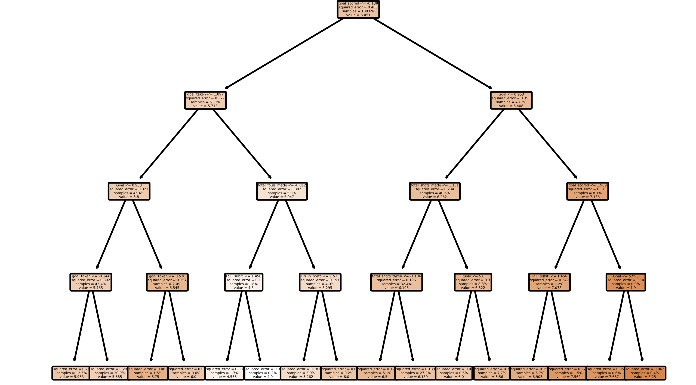
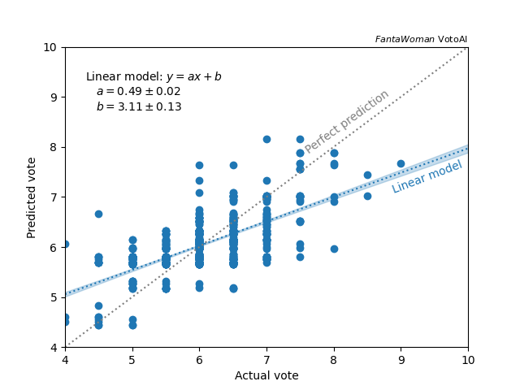
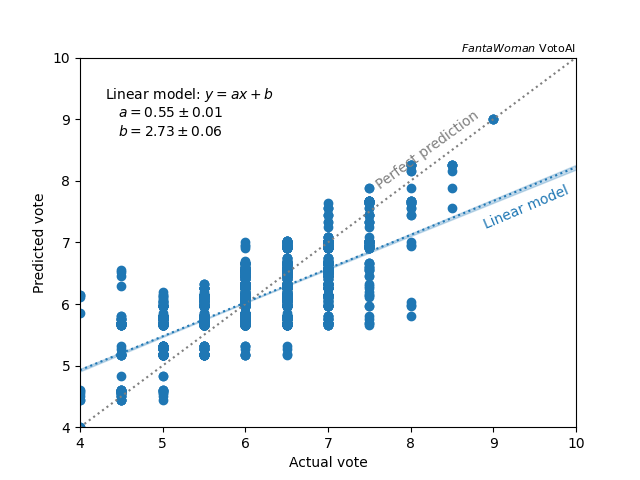
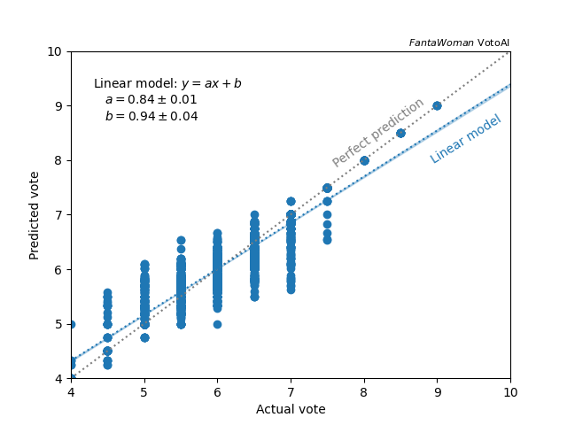
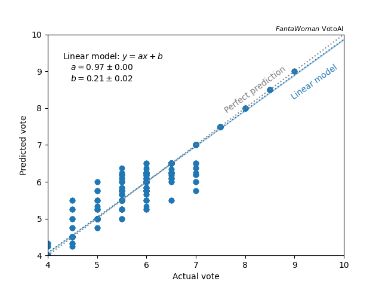
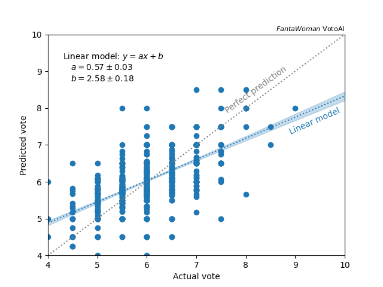
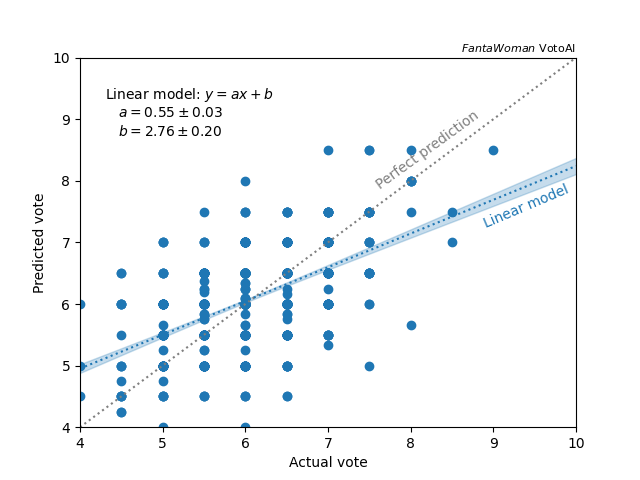
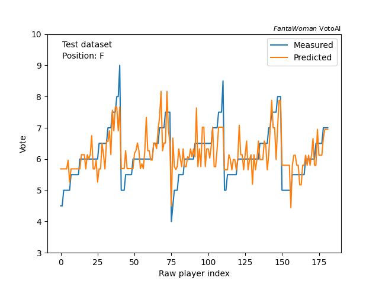
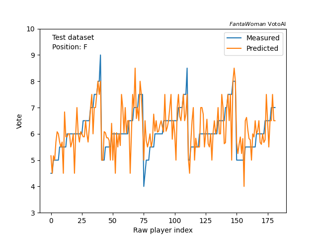

Decision Tree
-------------

A decision tree is one of the most intuitive models for classification and regression problems, but it may lack in accuracy in case of complex problems with poor statistics.
The implementation of the model is [here](https://github.com/paolosabatini/fanta-voto-ai/blob/main/training/models/tree_kf5.py).

## In a nutshell

The decision tree consists of an automated human that takes recursive decisions on splitting the initial dataset in order to minimize a given metric, resulting in a _tree_ structure (see the figure below)

 
<em> Scheme of one of the trained models, with a maximum depth of the tree set to 4.</em>

In case of regression problems, this metric measures the deviance of the target values of the selected dataset from the mean target value of the dataset.
Therefore, the decision tree will split the dataset in smaller and smaller bunches that tend to be more and more homogeneous in terms of target values.
Once a limit is reached (i.e. maximum depth of the tree or minimum number of training events in the bunch of data) the recursive splitting stops, and the model is created.
The score predicted by the model is the average score of the events in the _leaf_ dataset the event belongs to.

-  _Pros_ : intuitive structure and predictible behaviour
-  _Cons_ : given the small statistics of our dataset, the decision tree may not be able to catch the complexity of the problem before running out of stats.

### Training and performance

For this model, the k-folding cross-validation is also used (see [here](https://github.com/paolosabatini/fanta-voto-ai/blob/gh-pages/docs/kneigh_kf5.md) for a little more details).
The performances of the decision tree (with `max_depth` set to four) are shown below.

 
<em>  Correlation of the predicted and measured mark on test (left) and train (right). </em>

The variance of the predicted score is large even in the training sample, that demonstrate that the model is too simple to catch all the correlations. 
Indeed, the model is quite simple as shown in the figure above.
No big differences are observed in performance on training and testing samples, meaning that the model is bad but not sample-specific, it actually catches some real correlations in the dataset.

What if we increase the complexity of the model? 

### Training and performance

There are several parameters that let the model to increase the complexity, all of them tend to change the limit at which the recursive decision process stops. 
The most powerful (and intuitive) is `max_depth`. By increasing it, we could expect a better modeling of the training sample, hopefully reflected in the testing sample performance as well.
Here below, the performance of the models at different `max_depth` values.

 
<em>  Correlation of the predicted and measured mark on train sample with  `max_depth` set to 4 (left), 10 (center) and 50 (right). </em>   

 
<em>  Correlation of the predicted and measured mark on test sample with  `max_depth` set to 4 (left), 10 (center) and 50 (right). </em>  

The performance of the training sample indeed increase moving from 4 to 10, while not a big change is observed by moving from 10 to 50.  
However, a large degradation of the performance on the testing dataset is observed, meaning that a more complex model tends to overtrain on the training dataset features.
A summary table of the performance on the testing sample and structure of the algorithm is here below.

 

| `max_depth`   |  actual depth  |  Bias (G/D/M/F) | Variance (G/D/M/F) |
|:---------------:|:----------------:|:-----------------:|:--------------------:|
| 4  | 4  | -0.13 / 0.01 / -0.01 / 0.04 | 0.64 / 0.49 / 0.50 / 0.58 |
| 10 | 10 | -0.17 / 0.03 / -0.01 / 0.04 | 0.79 / 0.59 / 0.55 / 0.69 |
| 50 | 18 | -0.10 / 0.06 / -0.01 / 0.04 | 0.79 / 0.64 / 0.70 / 0.70 |

 

The large degragradation of the generalization of the prediction is observed at each step, and especially with the most complex model, meaning that the model uses the extra depth to learn dataset-specific features.
Also, the small statistics of the dataset bring to the impossibility of exploiting all the 50 levels of decisions of the last model, where the iteration is stopped by other criteria (e.g. minimum number of events in the leaf).

Let's see the whe prediction vs. measured mark of each training set on each event.

 
<em>  Predicted and measured mark on forward players in the testing dataset for the models with `max_depth` set to 4 (left) and 10 (right).  
The 5 _bunches_ of points correspond to 5 different trainings of the k-folding cross-validation.</em>

Note how the model with `max_depth` set to 4 tends to predict medium-range values and fail in reproducing the spikes. Therefore, its performances on test and training set are similar since they are dominated by medium values of the mark.
The model with `max_depth` set to 10, instead, has the opposite behavior. Looking at the first and last bunch of events (i.e. training models): the first model misses extreme values in the training (that are instead there in the testing sample), and tehrefore provides medium marks. The last training instead has a lot of extreme values (that are missing in its testing set), therefore has a quite spiky predicition.

Eventually, we can conclude that the poor stats does not let the decision tree to be complex and not overtrain.
